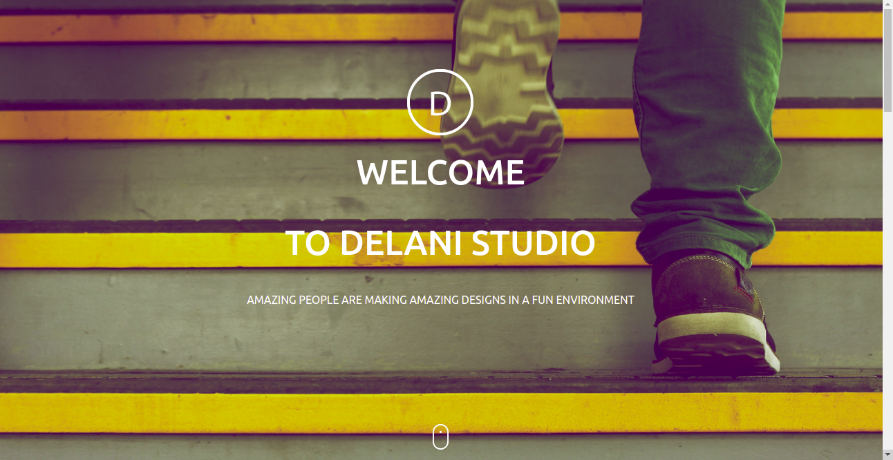

#Delani Studio

This is a simple landing page for Delani Studio.

##Description

This landing page is made of HTML CSS and JavaScript. 

##Installation

To open this webpage you are required to  copy this link https://blackcaleb.github.io/delaniStudio/ into your browser.

##Specifications

For this link to work the specifications are a browser application and also internet connection. This link doesnt require any special permissions to work.

##Usage

To navigate through the website just scroll up and down.

##Visuals

This is a screenshot of the webpage.

##Contributing

In a case you have any issue with this project you can always pull a request at the pull request centre. In the near future we will be adding new content so keep in touch with us. This project is open to contributions. If one has any contributions you should state so in the pull request centre and we will reach to you.

We would like to acknowledge Moringaschool and also @JoshuaBarawa they contributed a lot in the complition of this project.

#License

MIT License

Copyright (c)[2021][blackCaleb]
